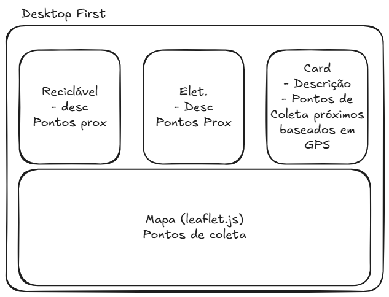
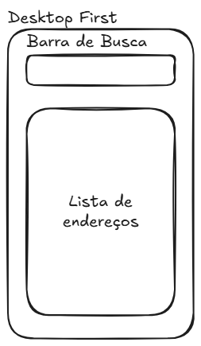

# Descartes-Seletivo
## Integrantes: 
- Enzo Benedetto Proença - RA: 10418579
- Livia Negrucci Cantowitz - RA: 10389419
- Victor Beltrame Sartos - RA: 10743709


## Explicação inicial sobre o processo de ideação
Conscientizar o público geral sobre reciclagem e descarte correto das diversas formas de lixo. Para isso, faremos uma página com duas características principais:
1. Cartões informativos com descrição do tipo do lixo e o ponto de coleta mais próximo.
2. Mapa com todos os pontos de coleta.

Esse projeto tem por foco atender as ODS 11 (Cidades e comunidades sustentáveis) e 13 (Ação contra a mudança global do clima), em particular a 11.4 (Fortalecer esforços para proteger e salvaguardar o patrimônio cultural e natural do mundo) e 13.3 (Melhorar a educação, aumentar a conscientização e a capacidade humana e institucional sobre mitigação, adaptação, redução de impacto e alerta precoce da mudança do clima).

## Imagens do protótipo 



### 1. Estrutura básica (HTML)

Estrutura da página: um `<header>` com o título do projeto, e uma `<section id="cards">` contendo três `<div class="card">` um para cada tipo de resíduo (Reciclável, Eletrônico e Outros).

```html
<div class="card" data-tipo="reciclavel">
  <h2>Reciclável</h2>
  <p>Papel, plástico, vidro e metal. Separe e leve até um ecoponto.</p>
</div>
```

### 2. Estilo (CSS)

O bloco `<style>` no `<head>` faz o design da página: cor de fundo, cabeçalho verde, e os cards com borda arredondada, sombra leve e alinhados lado a lado usando `display: flex`.

```css
#cards {
  display: flex;
  flex-wrap: wrap;
  justify-content: center;
  gap: 15px;
}
```

### 3. Botões e lista de pontos de coleta

Cada card tem um `<button>` e uma `<div class="pontos">` (escondida por padrão com `display: none`) contendo os pontos de coleta daquele tipo de resíduo.

```html
<button onclick="mostrarPontos('reciclavel')">Ver pontos de coleta</button>
<div class="pontos" id="pontos-reciclavel">
  - Ecoponto Pinheiros<br>
  - Ecoponto Consolação
</div>
```

### 4. Interação com JavaScript

Foi criada a função `mostrarPontos(tipo)`, que é chamada quando o usuário clica no botão do card. Ela faz duas coisas:

- Mostra ou esconde a lista de pontos de coleta daquele card (alternando o `display` entre `none` e `block`).
- Escreve uma mensagem no topo da página (`#mensagem`) dizendo qual tipo de resíduo foi selecionado.

```javascript
function mostrarPontos(tipo) {
  var lista = document.getElementById('pontos-' + tipo);

  if (lista.style.display === 'block') {
    lista.style.display = 'none';
  } else {
    lista.style.display = 'block';
  }

  var texto = document.getElementById('mensagem');
  texto.innerText = 'Pontos de coleta de ' + tipo;
}
```


### 5. Espaço reservado para o mapa

A `<section id="mapa-section">` com uma `<div id="mapa">` vazia, estilizada como um quadrado tracejado reserva o lugar onde o mapa vai entrar futuramente.

```html
<section id="mapa-section">
  <h2>Mapa de pontos de coleta</h2>
  <div id="mapa"></div>
</section>
```