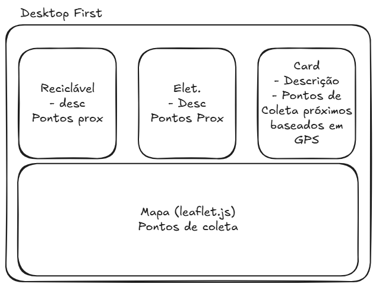
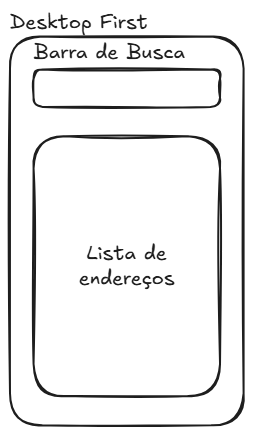
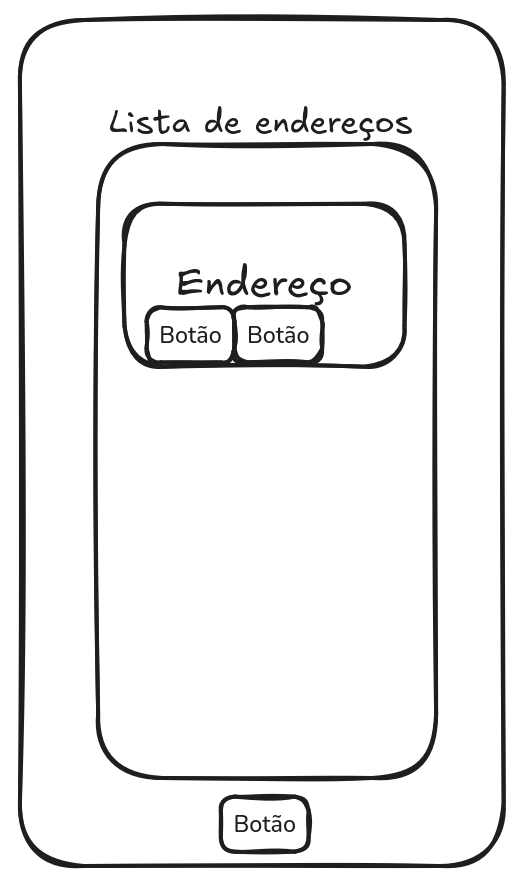

# Descartes-Seletivo
## Integrantes: 
- Enzo Benedetto Proença - RA: 10418579
- Livia Negrucci Cantowitz - RA: 10389419
- Victor Beltrame Sartos - RA: 10743709


## Explicação inicial sobre o processo de ideação
Conscientizar o público geral sobre reciclagem e descarte correto das diversas formas de lixo. Para isso, faremos uma página com duas características principais:
1. Cartões informativos com descrição do tipo do lixo e o ponto de coleta mais próximo.
2. Mapa com todos os pontos de coleta.

Esse projeto tem por foco atender as ODS 11 (Cidades e comunidades sustentáveis) e 13 (Ação contra a mudança global do clima), em particular a 11.4 (Fortalecer esforços para proteger e salvaguardar o patrimônio cultural e natural do mundo) e 13.3 (Melhorar a educação, aumentar a conscientização e a capacidade humana e institucional sobre mitigação, adaptação, redução de impacto e alerta precoce da mudança do clima).

## Imagens do protótipo 




### 1. Estrutura básica (HTML)

Estrutura da página: um `<header>` com o título do projeto, e uma `<section id="cards">` contendo três `<div class="card">` um para cada tipo de resíduo (Reciclável, Eletrônico e Outros).

```html
<div class="card" data-tipo="reciclavel">
  <h2>Reciclável</h2>
  <p>Papel, plástico, vidro e metal. Separe e leve até um ecoponto.</p>
</div>
```

### 2. Estilo (CSS)

O bloco `<style>` no `<head>` faz o design da página: cor de fundo, cabeçalho verde, e os cards com borda arredondada, sombra leve e alinhados lado a lado usando `display: flex`.

```css
#cards {
  display: flex;
  flex-wrap: wrap;
  justify-content: center;
  gap: 15px;
}
```

### 3. Botões e lista de pontos de coleta

Cada card tem um `<button>` e uma `<div class="pontos">` (escondida por padrão com `display: none`) contendo os pontos de coleta daquele tipo de resíduo.

```html
<button onclick="mostrarPontos('reciclavel')">Ver pontos de coleta</button>
<div class="pontos" id="pontos-reciclavel">
  - Ecoponto Pinheiros<br>
  - Ecoponto Consolação
</div>
```

### 4. Interação com JavaScript

Foi criada a função `mostrarPontos(tipo)`, que é chamada quando o usuário clica no botão do card. Ela faz duas coisas:

- Mostra ou esconde a lista de pontos de coleta daquele card (alternando o `display` entre `none` e `block`).
- Escreve uma mensagem no topo da página (`#mensagem`) dizendo qual tipo de resíduo foi selecionado.

```javascript
function mostrarPontos(tipo) {
  let lista = document.getElementById('pontos-' + tipo);

  if (lista.style.display === 'block') {
    lista.style.display = 'none';
  } else {
    lista.style.display = 'block';
  }

  var texto = document.getElementById('mensagem');
  texto.innerText = 'Pontos de coleta de ' + tipo;
}
```


### 5. Espaço reservado para o mapa

A `<section id="mapa-section">` com uma `<div id="mapa">` vazia, estilizada como um quadrado tracejado reserva o lugar onde o mapa entraria, preenchido depois com o Leaflet (seção 10).

```html
<section id="mapa-section">
  <h2>Mapa de pontos de coleta</h2>
  <div id="mapa"></div>
</section>
```

### 6. Segunda página: busca de endereços

Foi criada a página `enderecos.html`, com uma lista de ecopontos reais da cidade de São Paulo (dados públicos da Prefeitura/AMLURB). Essa página tem uma caixa de busca que filtra a lista conforme o usuário digita.

```html
<input type="text" id="busca" placeholder="Digite um bairro ou rua..." onkeyup="filtrarEnderecos()">
```

```javascript

function filtrarEnderecos() {
  let termo = document.getElementById('busca').value.toLowerCase();
  ket enderecos = document.getElementsByClassName('endereco');

  for (var i = 0; i < enderecos.length; i++) {
    let texto = enderecos[i].innerText.toLowerCase();

    if (texto.indexOf(termo) !== -1) {
      enderecos[i].style.display = 'block';
    } else {
      enderecos[i].style.display = 'none';
    }
  }
}
```

### 7. Menu de navegação

Foi adicionado um menu (`<nav>`) no topo das duas páginas, permitindo alternar entre a página inicial e a busca de endereços.

```html
<nav id="menu">
  <a href="descartes.html">Início</a>
  <a href="enderecos.html">Buscar Endereços</a>
</nav>
```

O menu foi depois ampliado com o link "Favoritos" e o link da página atual passou a receber `class="ativo"` (seção 12).

### 8. Semântica HTML5 e acessibilidade

Os cards da página inicial trocaram `<div>` por `<article>` e a lista de pontos de coleta, que era uma `<div>`, virou uma `<ul>` com `<li>`. As páginas também passaram a ser montadas com os elementos de estrutura do HTML5 (`<header>`, `<nav>`, `<main>` e `<footer>`).

```html
<article class="card" data-tipo="reciclavel">
  <h2>Reciclável</h2>
  <p>Papel, plástico, vidro e metal. Separe e leve até um ecoponto.</p>
  <button onclick="mostrarPontos('reciclavel')">Ver pontos de coleta</button>
  <ul class="pontos" id="pontos-reciclavel">
    <li>Ecoponto Pinheiros</li>
    <li>Ecoponto Consolação</li>
  </ul>
</article>
```

O atributo `data-tipo` identifica o tipo de resíduo de cada card; ele não é usado por nenhuma regra de CSS, e o tipo que o JavaScript precisa também é passado direto no `onclick` do botão.

Os recursos de acessibilidade se aplicam às mensagens e aos botões criados dinamicamente. O `#mensagem` é lido por leitores de tela (`aria-live`), os botões têm `title` e `aria-label`, e o botão de favorito expõe o estado com `aria-pressed`. Quando um ecoponto não tem coordenadas, o botão "Ver no mapa" fica desabilitado, o botão "Limpar todos" é escondido com `hidden` quando a lista está vazia, e o link da página atual no menu é destacado:

```html
<p id="mensagem" aria-live="polite"></p>
```

```javascript
botao.setAttribute('aria-label', rotuloFavorito(favoritado));
botao.setAttribute('aria-pressed', favoritado);
botaoMapa.disabled = semMapa;
botaoLimpar.hidden = favoritos.length === 0;
```

```css
#menu a.ativo {
  background-color: var(--cor-fundo-suave);
  color: var(--cor-destaque);
}
```

### 9. Base de dados dos ecopontos e variáveis de estilo (CSS)

Os 132 ecopontos reais da cidade de São Paulo ficam em um array `ENDERECOS` no início do `script.js`. Cada item tem `nome`, `endereco` e `coords`, e `coords` é `null` quando o ponto não tem posição no mapa — é consultada tanto para colocar o marcador quanto para desabilitar o botão "Ver no mapa". `CENTRO_SP` é a latitude e longitude usadas como visão inicial do mapa.

```javascript
const ENDERECOS = [
  {"nome": "Aricanduva", "endereco": "Av. Aricanduva, 200 (Viaduto Eng. Alberto Badra) - Aricanduva", "coords": [-23.5780239, -46.511454]},
  {"nome": "Astarte", "endereco": "Rua Astarte, 500 - Vila Carrão", "coords": [-23.5522801, -46.5263316]},
  ...
  {"nome": "Cidade Saudável", "endereco": "Rua Ptolomeu, 869 - Vila Socorro", "coords": null},
];

let CENTRO_SP = [-23.5505, -46.6333];
```

O CSS foi refatorado para usar variáveis: todas as cores, o tamanho de fonte, os raios de arredondamento e a sombra dos cards estão declarados uma única vez no `:root` e reutilizados com `var()` no restante do arquivo.

```css
:root {
  --cor-fundo: #f2f2f2;
  --cor-fundo-claro: #fff;
  --cor-fundo-suave: #e8f5e9;
  --cor-primaria: #1b3a2f;
  --cor-primaria-hover: #1b5e20;
  --cor-destaque: #2e7d32;
  --cor-favorito: #e0a300;
  --tamanho-texto: 14px;
  --raio-sm: 5px;
  --raio-md: 10px;
  --sombra-card: 1px 1px 5px var(--cor-borda);
}

.card {
  background-color: var(--cor-fundo-claro);
  border: 1px solid var(--cor-borda);
  border-radius: var(--raio-md);
  padding: 15px;
  width: 220px;
  text-align: center;
  box-shadow: var(--sombra-card);
}
```

### 10. Mapa interativo com Leaflet

O quadrado tracejado da seção 5 foi preenchido com o [Leaflet 1.9.4](https://leafletjs.com/), carregado por CDN no `<head>`. A função `iniciarMapa` cria o mapa, adiciona a camada de tiles do OpenStreetMap e centraliza em `CENTRO_SP`. Ela é carregada junto com o resto do `script.js` nas três páginas, por isso começa com duas guardas: se o `#mapa` não existir (páginas de busca e favoritos) ou se o Leaflet não carregou, a função simplesmente não faz nada.

```html
<link rel="stylesheet" href="https://unpkg.com/leaflet@1.9.4/dist/leaflet.css">
<script src="https://unpkg.com/leaflet@1.9.4/dist/leaflet.js"></script>
```

```javascript
function iniciarMapa() {
  let container = document.getElementById('mapa');
  if (!container || typeof L === 'undefined') return;

  let mapa = L.map('mapa').setView(CENTRO_SP, 12);

  L.tileLayer('https://{s}.tile.openstreetmap.org/{z}/{x}/{y}.png', {
    maxZoom: 19,
    attribution: '&copy; <a href="https://www.openstreetmap.org/copyright">OpenStreetMap</a>'
  }).addTo(mapa);
  ...
}
```

Quando o usuário não veio de um endereço específico, a função tenta a geolocalização do navegador. Em vez de um `if/else if`, a decisão é tomada por guard clauses — cada uma sai da função assim que o caso é resolvido — e a geolocalização ficou em uma função própria, `centralizarNaMinhaPosicao`, para o corpo do callback não ficar aninhado dentro do `else if`:

```javascript
  let nome = new URLSearchParams(window.location.search).get('ecoponto');
  if (nome) return colocarPin(mapa, nome);
  if (!navigator.geolocation) return;

  centralizarNaMinhaPosicao(mapa);
}

function centralizarNaMinhaPosicao(mapa) {
  navigator.geolocation.getCurrentPosition(function (pos) {
    let minhaPosicao = [pos.coords.latitude, pos.coords.longitude];
    mapa.setView(minhaPosicao, 14);
    L.marker(minhaPosicao).addTo(mapa).bindPopup('Você está aqui').openPopup();
  }, function () {});
}
```

Do endereço ao mapa: o botão "Ver no mapa" da lista de endereços e da lista de favoritos navega para a página inicial passando o nome do ponto na URL (`descartes.html?ecoponto=<nome>`). Com o parâmetro presente, `iniciarMapa` chama `colocarPin`, que localiza o item com `find` sem diferenciar maiúsculas de minúsculas, centraliza o mapa e abre o popup do ponto. Se o nome não existir ou o ponto não tiver coordenadas, o usuário recebe uma mensagem no `#mensagem` em vez de um mapa vazio.

```javascript
function irParaMapa(nome) {
  window.location.href = 'descartes.html?ecoponto=' + encodeURIComponent(nome);
}
```

```javascript
function colocarPin(mapa, nome) {
  let item = ENDERECOS.find(function (e) {
    return e.nome.toLowerCase() === nome.toLowerCase();
  });

  if (!item || !item.coords) {
    mostrarMensagem('Ponto sem coordenadas disponíveis: ' + nome);
    return;
  }

  mapa.setView(item.coords, 16);
  L.marker(item.coords).addTo(mapa)
    .bindPopup('<strong>' + item.nome + '</strong><br>' + item.endereco)
    .openPopup();

  mostrarMensagem('Ponto exibido no mapa: ' + item.nome);
}
```

### 11. Refatoração do JavaScript para funções de alta ordem

O `script.js` foi refatorado para usar funções de alta ordem no lugar dos laços e da montagem manual do DOM.

Helper de criação de elementos: no lugar de repetir `createElement` + `className` + `textContent` em cada card, tudo passa por um único helper.

```javascript
function criarElemento(tag, classe, texto) {
  let elemento = document.createElement(tag);

  if (classe) elemento.className = classe;
  if (texto) elemento.textContent = texto;

  return elemento;
}
```

`map` na construção da lista:** cada item do array `ENDERECOS` vira um card e os cards são injetados de uma vez com `replaceChildren`, o que também limpa a lista anterior sem precisar de um segundo laço.

```javascript
function renderizarLista(itens) {
  let lista = document.getElementById('lista-enderecos');
  if (!lista) return;

  lista.replaceChildren(...itens.map(criarCardEndereco));

  if (!itens.length)
    lista.appendChild(criarElemento('p', 'vazio', 'Nenhum ecoponto encontrado para essa busca.'));
}
```

`filter` na busca: a busca deixou de varrer o texto dos elementos do DOM e passou a filtrar o próprio array `ENDERECOS`. Assim o texto do botão ("Ver no mapa") não interfere mais no resultado, e a lista é redesenhada a partir dos dados.

```javascript
function combinarComTermo(item, termo) {
  return (item.nome + ' ' + item.endereco).toLowerCase().includes(termo);
}

function filtrarEnderecos() {
  let termo = termoBusca();
  renderizarLista(ENDERECOS.filter((item) => combinarComTermo(item, termo)));
  atualizarContagem(termo);
}
```

`reduce` nos contadores: o número de ecopontos que combinam com o termo e o resumo dos favoritos são calculados com `reduce`, percorrendo o array uma única vez.

```javascript
function contarCorrespondentes(termo) {
  return ENDERECOS.reduce((total, item) => total + (combinarComTermo(item, termo) ? 1 : 0), 0);
}

function resumirFavoritos(favoritos) {
  return favoritos.reduce(
    (resumo, favorito) => {
      if (favorito.coords) resumo.comMapa += 1;
      else resumo.semMapa += 1;
      return resumo;
    },
    { comMapa: 0, semMapa: 0 }
  );
}
```

O evento `onkeyup` do campo de busca também foi trocado por `oninput`, para que colar um texto ou limpar a busca com o "x" do `<input type="search">` também filtre a lista. A página ainda tem dois elementos auxiliares: o `<p id="contagem">`, alimentado por `contarCorrespondentes`, que mostra "Mostrando N de 132 ecopontos", e o `<p class="vazio">` que `renderizarLista` insere quando nenhum item combina com o termo.

```javascript
document.addEventListener('DOMContentLoaded', () => {
  construirLista();
  listarFavoritos();
  iniciarFavoritos();
  iniciarMapa();
});
```

### 12. Terceira página: favoritos salvos no navegador

Foi criada a página `favoritos.html`, onde ficam os ecopontos que o usuário favoritou. Cada card da lista de `enderecos.html` ganhou um botão `☆`/`★` ao lado do "Ver no mapa", e o menu das três páginas passou a ter três links — "Início", "Buscar Endereços" e "Favoritos" —, com `class="ativo"` no link da página atual.

As informações são salvas no `localStorage` do navegador, na chave `descartes:favoritos`, como um array JSON de objetos com `nome`, `endereco` e `coords`. O acesso ao `localStorage` é sempre protegido com `try/catch` (modo privado, cota excedida ou dados corrompidos), e o `JSON.parse` só aceita o resultado se ele for de fato um array.

```javascript
const CHAVE_FAVORITOS = 'descartes:favoritos';

function carregarFavoritos() {
  try {
    let dados = JSON.parse(localStorage.getItem(CHAVE_FAVORITOS));
    return Array.isArray(dados) ? dados : [];
  } catch (erro) {
    return [];
  }
}

function salvarFavoritos(favoritos) {
  try {
    localStorage.setItem(CHAVE_FAVORITOS, JSON.stringify(favoritos));
    return true;
  } catch (erro) {
    return false;
  }
}
```

O botão de favorito lê o estado salvo para decidir se começa preenchido, e o clique alterna a entrada usando `findIndex` + `push`/`splice`. A função devolve um objeto com os dois resultados possíveis — `salvou` (a gravação no `localStorage` funcionou) e `favoritou` (a operação foi adicionar, e não remover) — para que a interface consiga distinguir uma falha de gravação de uma remoção. Se a gravação falhar, o `★`/`☆` do botão não muda e a mensagem de erro é mostrada, em vez de confirmar uma operação que não foi persistida.

```javascript
function alternarFavorito(item) {
  let favoritos = carregarFavoritos();
  let indice = favoritos.findIndex((favorito) => favorito.nome === item.nome);
  let favoritou = indice === -1;

  if (favoritou)
    favoritos.push({ nome: item.nome, endereco: item.endereco, coords: item.coords });
  else
    favoritos.splice(indice, 1);

  return { salvou: salvarFavoritos(favoritos), favoritou };
}
```

```javascript
function alternarFavoritoNaLista(item, botao) {
  let { salvou, favoritou } = alternarFavorito(item);

  if (!salvou) {
    mostrarMensagem(MSG_FALHA_FAVORITOS);
    return;
  }

  atualizarBotaoFavorito(botao, favoritou);
  mostrarMensagem((favoritou ? 'Adicionado aos favoritos: ' : 'Removido dos favoritos: ') + item.nome);
}
```

Na página de favoritos, a lista é montada com `map` a partir do que foi salvo, com um botão para remover cada item e um botão "Limpar todos" (que só aparece quando há algo salvo). Ecopontos sem coordenadas mostram um aviso e têm o botão "Ver no mapa" desabilitado.

```javascript
function listarFavoritos() {
  let lista = document.getElementById('lista-favoritos');
  if (!lista) return;

  let favoritos = carregarFavoritos();

  lista.replaceChildren(...favoritos.map(criarCardFavorito));
  // ...
}
```
